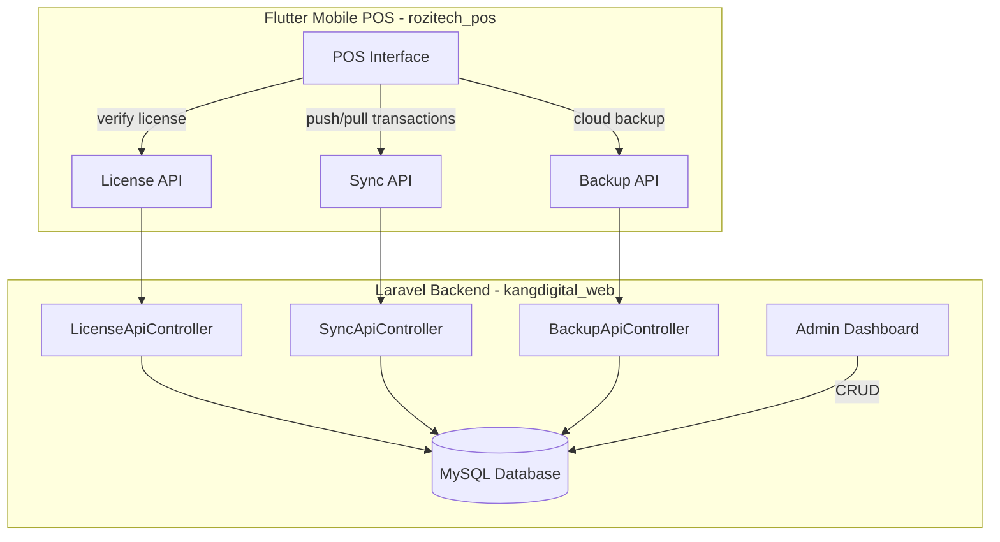

# 🛒 Kang Digital - Unified POS & Administrative Platform

Welcome to the official repository of the **Kang Digital** ecosystem. This repository contains both the web-based administrative backend and the offline-first Flutter mobile POS client.



---

## 📂 Repository Structure

- **`/kangdigital_web`**: The Laravel 11 administrative dashboard and API gateway.
- **`/rozitech_pos`**: The Dart/Flutter offline-first Point of Sale application.

---

## 🖥️ 1. Laravel Web Backend (`kangdigital_web`)

The web component serves as the central administrative hub, public landing page, and sync coordinator.

### 🌟 Key Features
- **Central Dashboard**: Unified card-based control portal for leads, active member licenses, and website pricing.
- **Member Management**: Create, search, disable, and reset credentials for owners and cashiers.
- **License Engine**: Create custom validation keys with device limitations, durations (monthly/yearly/lifetime), and automatic activation hooks.
- **Sync Endpoints**: Handles JSON-payload batch syncing for categories, products, cashiers, transaction logs, and expenses.

### 🛠️ Tech Stack
- **Framework**: Laravel 11.x (PHP 8.2+)
- **Database**: MySQL / MariaDB
- **Styling**: Vanilla CSS, FontAwesome 6.4, Plus Jakarta Sans & Outfit Google Fonts
- **Integrations**: WhatsApp API redirects

### 🚀 Getting Started
1. **Configure Environment**:
   ```bash
   cd kangdigital_web
   cp .env.example .env
   ```
   Define your database configurations (`DB_DATABASE=kasirumkm`, etc.).
2. **Install Dependencies**:
   ```bash
   composer install
   npm install && npm run build
   ```
3. **Database Migration & Seeding**:
   ```bash
   php artisan migrate:fresh --seed
   ```
   *Seeders will generate a default admin: `admin@kangdigital.web.id` / `admin123`*
4. **Launch Server**:
   ```bash
   php artisan serve
   ```

---

## 📱 2. Flutter Mobile POS (`rozitech_pos`)

An offline-first POS application designed for micro, small, and medium enterprises (MSMEs).

### 🌟 Key Features
- **Granular RBAC Security**: Role-based access guarding for Owner, Manager, and Cashier tiers.
- **Offline-First Synchronization**: Local SQLite database queries syncing to cloud servers whenever a connection is established.
- **Thermal Printing**: Built-in support for thermal ESC/POS receipt generation via Bluetooth.
- **Cloud Backup**: Automated raw DB state upload triggers for full data restoration capability.
- **License Authorization**: Restricts access based on device limits set in the web administrator portal.

### 🛠️ Tech Stack
- **Framework**: Flutter (Dart)
- **State Management**: Riverpod (for responsive state notification)
- **Database**: Drift / SQLite
- **Networking**: Dio Client

### 🚀 Getting Started
1. **Prerequisites**: Ensure Flutter SDK (3.x+) is installed.
2. **Install Packages**:
   ```bash
   cd rozitech_pos
   flutter pub get
   ```
3. **Generate Local Database Classes**:
   ```bash
   flutter pub run build_runner build --delete-conflicting-outputs
   ```
4. **Compile & Run**:
   - Run on Android emulator or connected device:
     ```bash
     flutter run
     ```

---

## 🤝 Contribution Guidelines
When making updates:
- Keep the design language consistent (use CSS variables defined in `stores.blade.php`).
- Ensure compile errors are resolved in the mobile POS app by checking `flutter analyze` prior to committing.
- Commit messages should follow conventional commit formatting.
